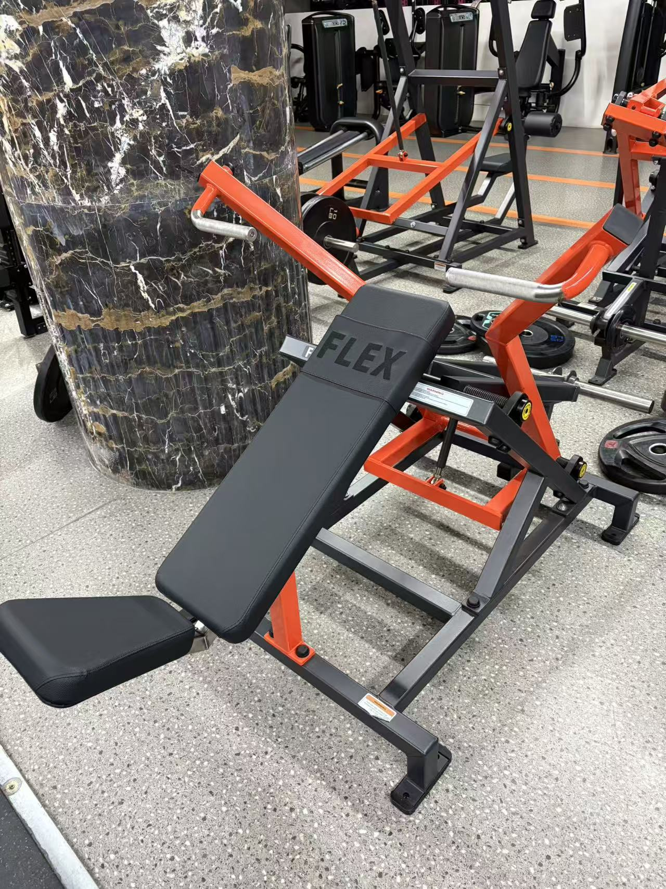

‍
## 私教课记录

@hutianle
‍

|次数|日期|时间|部位|阶段性测量|
| :----: | ------------| -------| --------| -------------------------------------------------------------------------------------------------------------------------------------------------------------------------------------------------------|
|1|2025.12.20|8-9|胸、背|体重：68.9kg；骨骼肌：27.3kg；体脂率：29.5%；BMI：24.7|
|2|2025.12.27|14-15|腿||
|3|2026.1.10|14-15|胸、背||
|4|2026.1.18|19-20|腿||
|5|2026.1.24|9-10|胸、背|体重：66.6kg；骨骼肌：25.4kg；体脂率：31.7%；BMI：24.2|
|6|2026.1.31|9-10|腿|体重：66.4kg；骨骼肌：25.6kg；体脂率：31.1%；BMI：24.1|
|7|2026.2.7|10-11|胸、背||

‍

## 肩

**分动式推肩机 (Iso-Lateral Shoulder Press)**

- **外观特征（如何辨认）：**

  - ​**靠背角度**​：座椅靠背非常直，接近​**垂直**（大约 80-90 度角），人是正坐着的。
  - ​**把手位置**：把手的起始位置更高，基本与肩膀或头部平齐。
  - ​**推举轨迹**​：推的时候是**垂直向上**推举过头顶。
- **锻炼到的肌肉群：**

  - ​**主要目标：三角肌（Deltoids）** ​，尤其是**前束**和​**中束**。这是把肩膀练宽、练圆，打造“倒三角”身材的核心动作。
  - **次要发力：**  肱三头肌（手臂后侧）和斜方肌上部。

‍

## 上胸

**分动式上斜推胸机 (Iso-Lateral Incline Press)**

- **外观特征（如何辨认）：**

  - ​**靠背角度**​：这是最明显的区别。你可以看到它的座椅靠背是**向后倾斜**的（大约 45 度角），人是半躺着坐的。
  - ​**把手位置**：把手的起始位置比较低，大约在胸部上方的位置。
  - ​**推举轨迹**​：推的时候是向**斜前方**推出去。
- **锻炼到的肌肉群：**

  - ​**主要目标：胸大肌上束（Upper Chest）** 。这是练出饱满胸肌上沿、填补锁骨下方空缺的关键动作。
  - **次要发力：**  三角肌前束（肩膀前侧）和肱三头肌（手臂后侧）。

‍

## 中胸

‍

这个器械的学名通常叫**分动式坐姿推胸机 (Iso-Lateral Bench Press / Chest Press)** 。它的动作模式是模拟我们最熟悉的“平板杠铃卧推”。

**为什么它是练“中胸”的？**

- ​**把手的高度**​：当你坐在座椅上时，你会发现这两个把手的高度正好处于你的​**胸部正中间**（乳头连线的高度），而不是像刚才那个推肩机那样高过头顶，也不是像上斜推胸机那样位于锁骨下方。
- ​**推举轨迹**​：注意它的力臂支点在下方，推出去的方向是**水平向前**的（相对于身体躯干垂直）。这种垂直于躯干向前推的动作，最主要刺激的就是​**胸大肌的中束**（整体厚度）。
- ​**座椅角度**：座椅靠背虽然有一点点后仰，但基本是接近垂直的。这让你能够在一个稳定的坐姿下，模拟平躺推举的发力感。

**锻炼到的肌肉群**

- **核心目标（主要发力）** ：**胸大肌中束** 。这是决定胸肌整体围度和厚度的关键区域。
- ​**协同肌（辅助发力）** ：

  - ​**肱三头肌**：负责伸直手臂。
  - ​**三角肌前束**：肩膀前侧会参与辅助，但相比推肩机，参与度会低一些。

‍
